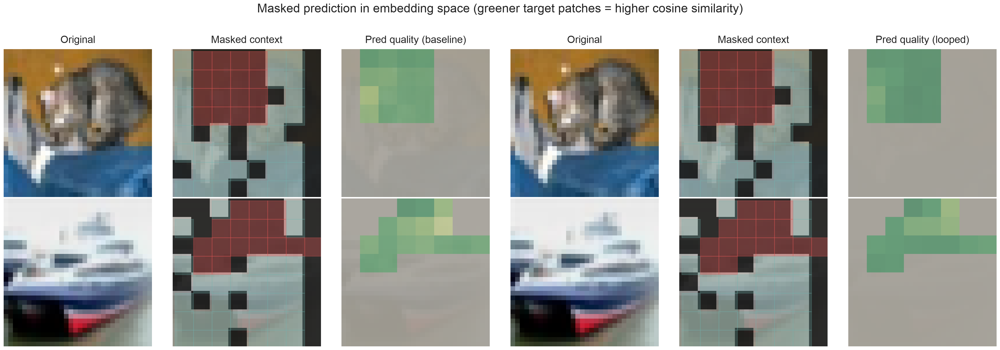
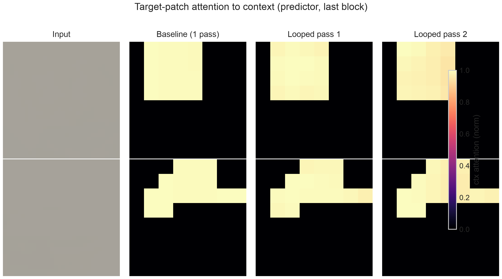
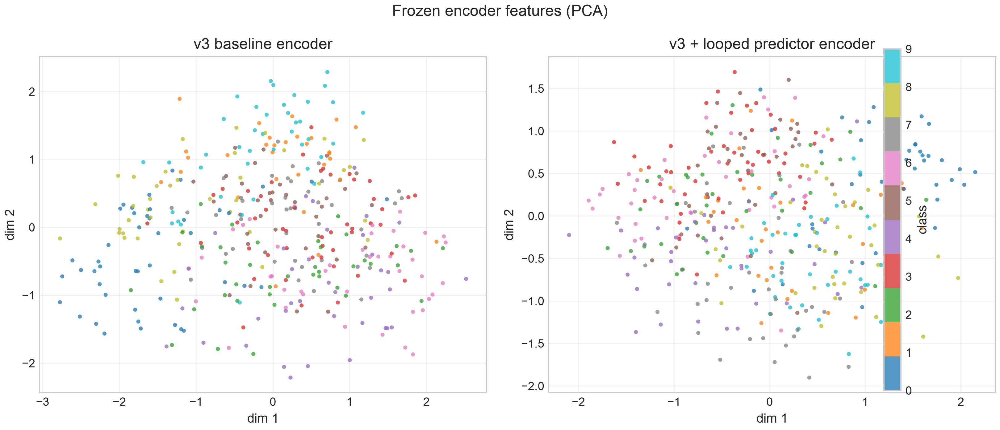
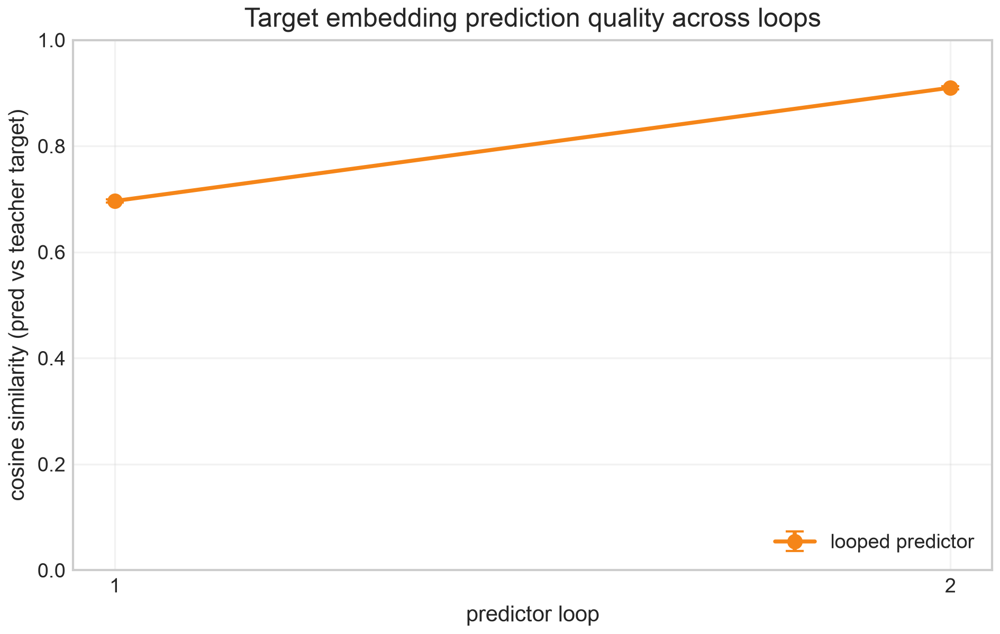
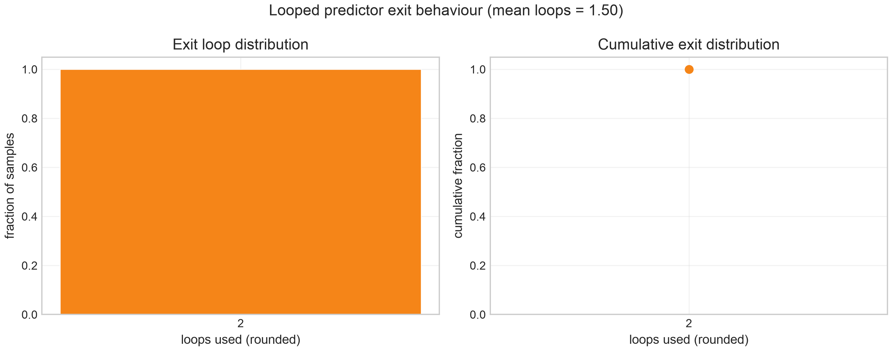
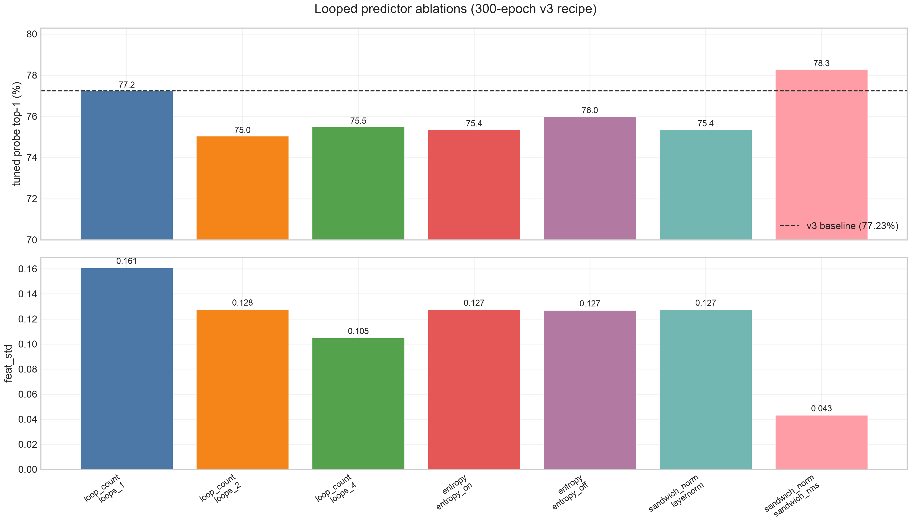
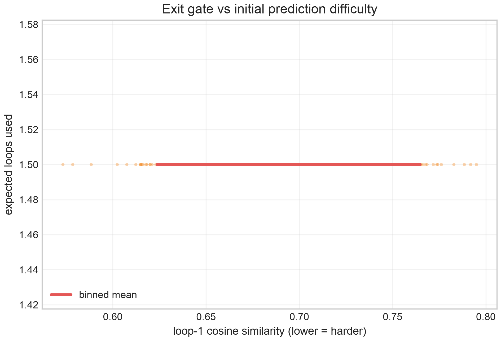

<div align="center">

# Recurrent Latent Prediction with I-JEPA on CIFAR-10

**A compact, reproducible Image-JEPA stack with a weight-shared looped predictor, built for interpretable world modeling under a 10M-parameter budget.**

[](pyproject.toml)
[](pyproject.toml)
[](app.py)
[](model_cards/v3_baseline.md)
[](#license)

*Self-supervised ViT encoders · masked latent prediction · adaptive-depth recurrence · publication figures · transfer to aerial imagery*

[Quickstart](#installation--quickstart) ·
[Results](#key-results) ·
[Gallery](#visual-gallery) ·
[Report](docs/IJEPA_Looped_Predictor_Report.md) ·
[Portfolio](portfolio_notes.md) ·
[Demo](#gradio-demo) ·
[Model cards](model_cards/) ·
[Reproduce](REPRODUCTION.md)

</div>

---

## Hook

**Image-JEPA** (LeCun et al.) learns visual representations by predicting *latent* embeddings of masked regions from context, with no pixels and no contrastive negatives. This repository implements a **faithful, end-to-end I-JEPA pipeline** on CIFAR-10 and asks a question central to embodied AI and world models:

> *What if the predictor that fills in missing latent structure is **recurrent**, refining its guess over multiple shared-weight steps, with a learned exit gate that spends compute only where needed?*

This project releases two trained models (baseline + looped), a **seven-variant ablation suite**, publication-quality visualizations (including per-loop attention evolution), aerial transfer experiments, and an interactive Gradio demo, all under **~9.9M trainable parameters**, small enough for edge deployment and fast iteration.

---

## Motivation & why a looped predictor?

JEPA-style training treats perception as **predictive coding in representation space**: the encoder sees a partial view; the predictor infers what the full scene *means* in latent space, supervised by an EMA teacher. That is already a primitive world model, but the standard predictor is a **single feed-forward pass**.

**Recurrent latent dynamics** mirror how agents iteratively refine beliefs: early loops capture coarse structure; later loops resolve ambiguity. A **weight-shared** stack adds depth at **zero extra parameters**, only compute scales. A learned **exit gate** implements adaptive depth: easy inputs exit early, hard inputs recurse.

This repo isolates the predictor change while holding the v3 encoder recipe fixed, so comparisons are honest. Along the way I document stability lessons that matter at small scale:

| Design choice | Rationale |
| --- | --- |
| Deterministic target subselection | Random subselection caused representation collapse (~64% probe); reverted to `sorted(targets)[:N]` |
| EMA momentum cap at 0.9999 | At 1.0 the final EMA step is a no-op; `feat_std` decayed in v1 |
| Exit-gate entropy regularization | Prevents degenerate always-early / always-late exits |
| Sandwich RMSNorm in the predictor | Strongest ablation (+1.05 pp over baseline); normalization > raw loop count |
| RandAugment + mild RRC at 32×32 | Strong aug without destroying 4×4 patch structure |

The default looped checkpoint **does not beat** the baseline on in-domain CIFAR-10 probing (−2.1 pp). That negative result is informative: recurrence alone is insufficient without the right predictor normalization, and the **transfer** and **ablation** stories are where the science lives.

---

## Key results

Official metric: **tuned linear probe** on frozen features (cosine LR, sweep `{3e-4, 1e-3, 3e-3}`, feature standardization, 300-epoch pretraining).

### Released models

| Model | Tuned top-1 | `feat_std` | Params | Notes |
| --- | ---: | ---: | ---: | --- |
| **[v3 baseline](v3_baseline/)** | **77.23%** | 0.1607 | 9.87M | Publication reference encoder |
| [v3 looped](v3_looped/) | 75.13% | 0.1450 | 9.87M | 2-loop + exit gate; **−2.10 pp** vs baseline |
| [sandwich-RMSNorm](results/ablations/) | **78.28%** | 0.0432 | 9.87M | Best ablation; looped + sandwich norm |

### Full ablation suite (300 epochs each, v3 recipe)

| Variant | Tuned top-1 | `feat_std` | Mean loops |
| --- | ---: | ---: | ---: |
| loops_1 | 77.24% | 0.1609 | 1.00 |
| loops_2 | 75.04% | 0.1276 | 1.50 |
| loops_4 | 75.49% | 0.1049 | 1.88 |
| entropy_on | 75.36% | 0.1275 | 1.50 |
| entropy_off | 76.00% | 0.1270 | 1.55 |
| layernorm | 75.36% | 0.1275 | 1.50 |
| **sandwich_rms** | **78.28%** | 0.0432 | 1.50 |

**Takeaways (honest):**

- Default looped predictor (LayerNorm, 2 loops): **−2.1 pp** in-domain; recurrence without the right norm hurts `feat_std` and probe accuracy.
- **Normalization dominates loop count:** sandwich-RMSNorm beats both baseline and all other ablations.
- **Transfer flips the story:** frozen looped encoder **+4.0 pp** over frozen baseline on aerial imagery (see below).
- Per-loop analysis: mean cosine gain loop 1 → final ≈ **+0.21**; exit gate ≈ **50% / 50%** at loops 1 and 2 (expected depth **1.5**).

Details: [`results/ablations/summary.md`](results/ablations/summary.md) · [`runs/looped_v3_comparison.json`](runs/looped_v3_comparison.json)

---

## Visual gallery

All figures are generated at **300 DPI** (PNG + PDF). Regenerate with [`visualizations/generate_all_figures.py`](visualizations/generate_all_figures.py).

<table>
<tr>
<td width="50%">

**Masked latent prediction: baseline vs looped**

Target patches tinted by cosine similarity to the EMA teacher (greener = better).



</td>
<td width="50%">

**Predictor attention across loops**

Where the looped predictor looks in context; attention sharpens with refinement.



</td>
</tr>
<tr>
<td>

**Embedding space (t-SNE)**

Frozen encoder features: baseline vs looped.



</td>
<td>

**Per-loop cosine to teacher**

Aggregate refinement curve across validation batches.



</td>
</tr>
<tr>
<td>

**Exit-loop distribution**

Learned adaptive depth on the validation set.



</td>
<td>

**Ablation summary**

All seven predictor variants, tuned probe.



</td>
</tr>
<tr>
<td colspan="2">

**Per-loop deep dive** ([`visualizations/loop_analysis/`](visualizations/loop_analysis/)): exit stats, cosine/L1 by loop, difficulty vs loops, early/late exit examples.



</td>
</tr>
</table>

More: [`visualizations/README.md`](visualizations/README.md)

---

## Installation & quickstart

```bash
git clone https://github.com/JMangold0352/looped-jepa.git && cd looped-jepa
uv sync --extra dev          # or: pip install -r requirements-dev.txt
source .venv/bin/activate

python scripts/verify_install.py
python -m pytest tests/test_shapes.py -v

# Official evaluation: requires checkpoint (train or copy weights)
python scripts/linear_probe.py \
  --config configs/image_jepa_cifar10_v3.yaml \
  --checkpoint checkpoints/baseline_v3/latest.pt
```

**Optional extras**

| Extra | Install | Use |
| --- | --- | --- |
| `demo` | `uv sync --extra demo` | Gradio app (`app.py`) |
| `viz` | `uv sync --extra viz` | t-SNE embeddings in figure suite |
| `transfer` | `uv sync --extra transfer` | Roboflow / EuroSAT transfer |

**Load encoder in Python**

```python
import torch
from jepa.models.jepa import IJEPA
from jepa.utils.config import load_config

cfg = load_config("configs/image_jepa_cifar10_v3.yaml")
model = IJEPA.from_config(cfg)
ckpt = torch.load("checkpoints/baseline_v3/latest.pt", map_location="cpu", weights_only=False)
model.load_state_dict(ckpt["model"], strict=False)
model.eval()
features = model.encoder.forward_all_patches(images)  # (B, 64, 384)
```

---

## Reproduce training, evaluation & visualizations

### Train

```bash
# v3 baseline (~300 epochs, MPS/CUDA)
python scripts/train_jepa.py --config configs/image_jepa_cifar10_v3.yaml

# v3 looped predictor (same recipe, recurrent predictor + exit gate)
python scripts/train_jepa.py --config configs/image_jepa_cifar10_v3_looped.yaml
```

### Evaluate

```bash
# Tuned linear probe (official metric)
python scripts/linear_probe.py \
  --config configs/image_jepa_cifar10_v3.yaml \
  --checkpoint checkpoints/baseline_v3/latest.pt

# Head-to-head baseline vs looped
python scripts/compare_looped_v3.py \
  --baseline-checkpoint checkpoints/baseline_v3/latest.pt \
  --looped-checkpoint checkpoints/baseline_v3_looped/latest.pt

# Full ablation suite (train + eval all 7 variants)
python scripts/run_ablations.py --suite all --train
```

### Visualizations

```bash
# Full publication figure set + per-loop deep dive (~30–90 min)
python visualizations/generate_all_figures.py

# Smoke test (~2 min)
python visualizations/generate_all_figures.py --fast

# Per-loop analysis only (Prompt 3 figures)
python visualizations/generate_all_figures.py --loop-analysis-only
```

Full reproduce-from-scratch guide: [**REPRODUCTION.md**](REPRODUCTION.md) · Experiment narrative: [**REPORT.md**](REPORT.md)

---

## Gradio demo

Interactive side-by-side comparison: upload any image, toggle **1 / 2 / 4** predictor loops, watch **attention evolve loop-by-loop**, inspect exit-gate stats, and optionally run a **CIFAR-10 linear probe** on frozen features.

```bash
uv sync --extra demo && python app.py    # http://127.0.0.1:7860
```

| | |
| --- | --- |
| **Local** | [`app.py`](app.py) · [`demo/README.md`](demo/README.md) |
| **Hugging Face Spaces** | *Coming soon: `app.py` is the Space entry point; see `requirements.txt`* |

> The shipped looped checkpoint was trained with `max_loops=2`. Selecting **4 loops** in the demo extrapolates beyond training (the UI shows a caveat).

---

## Transfer learning

Frozen-encoder transfer (backbone not fine-tuned; linear probe on top). Primary benchmark: **EuroSAT RGB** as an aerial/satellite proxy (1500 train / 400 val). Roboflow *Aerial Maritime Drone* runs with `--download` when `ROBOFLOW_API_KEY` is set.

| Method | Top-1 | Macro F1 | Notes |
| --- | ---: | ---: | --- |
| frozen v3 baseline | 72.75% | 75.66% | CIFAR-10 pretrained |
| **frozen v3 looped** | **76.75%** | 75.43% | **+4.0 pp** vs baseline |
| scratch ResNet18 | 77.50% | 67.06% | Trained on transfer data only |

```bash
python scripts/transfer_roboflow.py --source eurosat

# Roboflow maritime (recommended for defense/autonomy narrative)
export ROBOFLOW_API_KEY="..."
python scripts/transfer_roboflow.py --download \
  --workspace demm --project aerial-maritime-drone-dataset --version 1 \
  --roboflow-format yolov8 --data-dir data/transfer/aerial_maritime
```

Qualitative saliency: `results/transfer/qualitative_baseline_gradcam.png` · Full write-up: [`results/transfer/transfer_results.md`](results/transfer/transfer_results.md) · [**Transfer model card**](model_cards/transfer.md)

**CIFAR-100** (label-space shift): 46.32% top-1 with frozen v3 baseline (vs 77.2% in-domain).

---

## Model cards

Professional cards with architecture diagrams, training recipes, performance tables, limitations, defense/autonomy relevance, and load-and-run snippets.

| Card | Summary |
| --- | --- |
| [**v3 baseline**](model_cards/v3_baseline.md) | I-JEPA ViT encoder, non-looped predictor, **77.23%** |
| [**v3 looped**](model_cards/v3_looped.md) | Weight-shared recurrence + exit gate, 75.13% probe, +4 pp transfer |
| [**transfer**](model_cards/transfer.md) | Frozen-encoder downstream probing |
| [**Index**](model_cards/README.md) | All cards + version hubs |

Version hubs: [`v3_baseline/`](v3_baseline/) · [`v3_looped/`](v3_looped/)

---

## Relevance to defense, autonomy & edge AI

| Theme | How this repo connects |
| --- | --- |
| **Drone / aerial world models** | Self-supervised encoders pretrained on abundant unlabeled imagery; looped variant transfers better to aerial domains (+4 pp) |
| **Planning & latent dynamics** | JEPA predicts future *structure* in latent space, a stepping stone toward predictive world models for model-based RL |
| **Adaptive compute** | Exit gate = per-sample depth; useful when latency budgets vary (easy terrain vs cluttered harbor) |
| **Interpretability** | Per-loop attention maps, exit distributions, and mask-reconstruction panels make predictor behavior inspectable |
| **Edge deployment** | **<10M params**, 32×32-native stack suitable for embedded inference after mission-specific adaptation |
| **Label efficiency** | Frozen SSL backbone + small linear head reduces annotation burden for mission-specific classes |

This is research code, not a deployed system, but the artifact chain (train → ablate → visualize → transfer → demo) is designed to be legible to autonomy and defense R&D audiences.

---

## Repository layout

```
looped-jepa/
├── v3_baseline/ · v3_looped/     Version hubs (config + checkpoint pointers)
├── model_cards/                  Professional model documentation
├── results/                      Ablation + transfer JSON/MD summaries
├── visualizations/               Figure code + rendered outputs
├── app.py · demo/                Gradio interactive demo
├── src/jepa/                     Core library (models, train, eval, masking)
├── configs/ · scripts/ · tests/
├── checkpoints/ · data/ · runs/  (gitignored, local artifacts)
└── docs/                         Technical report, code review
```

---

## Citation

If you use this codebase or checkpoints in your work, please cite:

```bibtex
@misc{jepa_cifar10_v3_looped_2026,
  title        = {Recurrent Latent Prediction with I-JEPA on CIFAR-10},
  author       = {jepa-ouro},
  year         = {2026},
  howpublished = {\url{https://github.com/JMangold0352/looped-jepa}},
  note         = {Self-supervised ViT encoders with looped predictor under 10M parameters}
}
```

**Acknowledgments**

- [**I-JEPA**](https://arxiv.org/abs/2301.08243): LeCun, Assran, et al.; masked latent prediction framework
- [**Vision Transformer**](https://arxiv.org/abs/2010.11929): Dosovitskiy et al.
- **Ouroboros / recurrent predictor** lineage: weight-shared depth as a compute knob at fixed capacity
- **CIFAR-10**: Krizhevsky; **EuroSAT**: aerial transfer proxy; **Roboflow**: maritime drone dataset API

---

## Documentation index

| Doc | Contents |
| --- | --- |
| [**IJEPA Looped Predictor Report**](docs/IJEPA_Looped_Predictor_Report.md) | **Portfolio artifact**: full technical blog / extended report |
| [**portfolio_notes.md**](portfolio_notes.md) | Interview talking points; defense/autonomy relevance |
| [**results/README.md**](results/README.md) | Results, figures, and report links |
| [**CONTRIBUTING.md**](CONTRIBUTING.md) | How to extend the codebase |
| [**github_review/README.md**](github_review/README.md) | Pre-push publish checklist |
| [**scripts/README.md**](scripts/README.md) | Every CLI entry point |
| [REPRODUCTION.md](REPRODUCTION.md) | Reproduce training and evaluation from scratch |
| [REPORT.md](REPORT.md) | v3 training report; v4/v5 failed experiments |
| [docs/TECHNICAL_REPORT.md](docs/TECHNICAL_REPORT.md) | Synthesis report |
| [visualizations/README.md](visualizations/README.md) | Figure pipeline |
| [results/README.md](results/README.md) | Results index |

---

## License

Research and educational use. See config headers for experiment lineage and version history.
