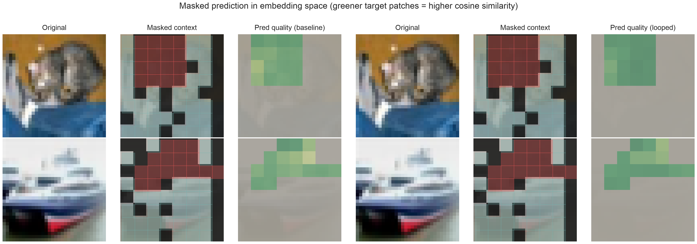
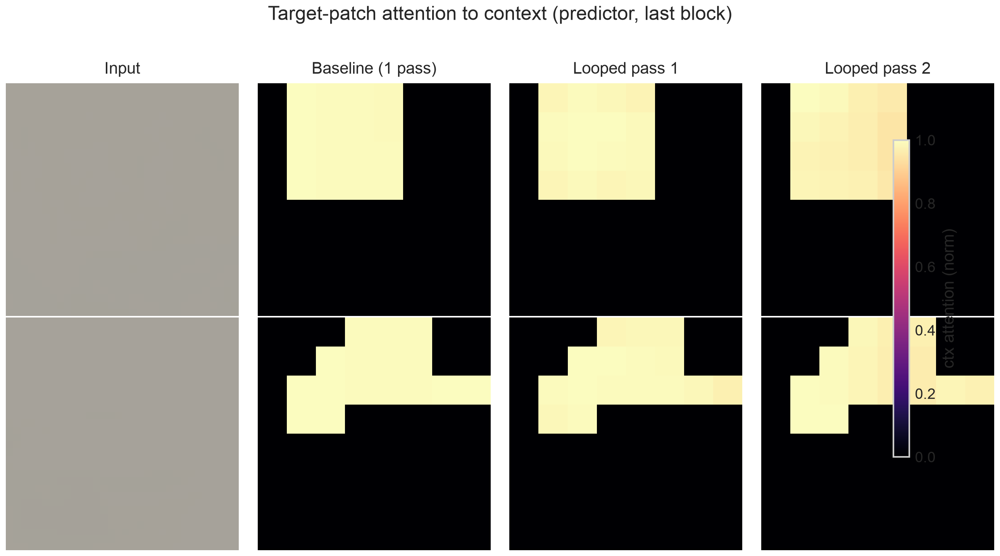
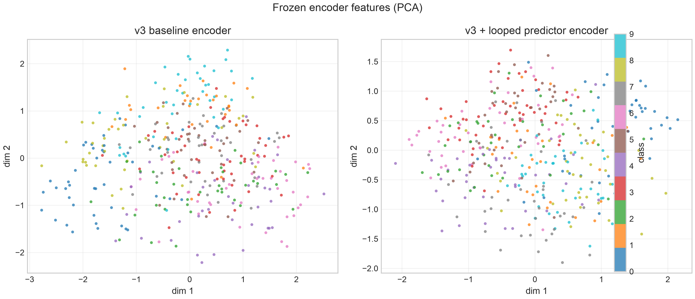
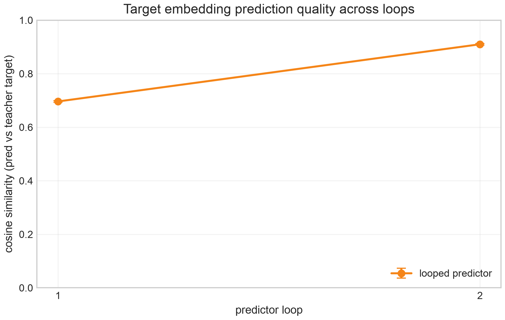
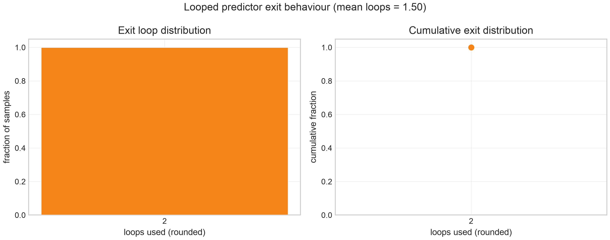
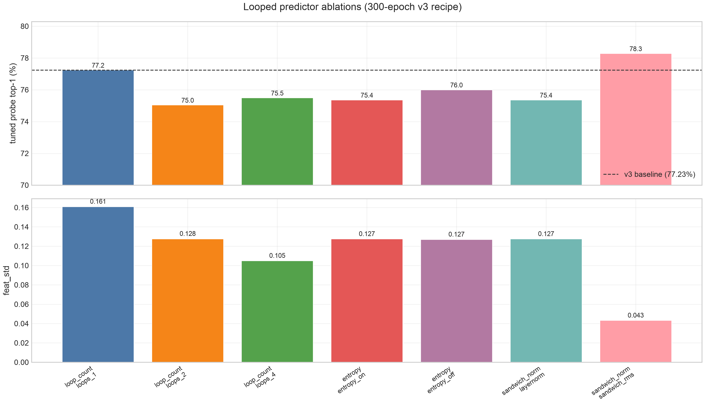
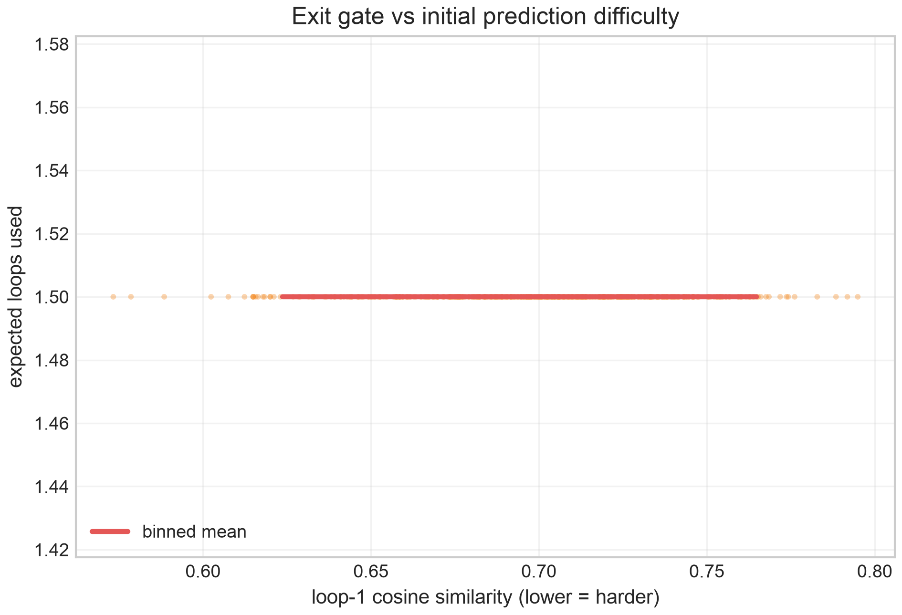

<div align="center">

# Recurrent Latent Prediction with I-JEPA on CIFAR-10

**A compact, reproducible Image-JEPA stack with a weight-shared looped predictor, built for interpretable world modeling under a 10M-parameter budget.**

[](pyproject.toml)
[](pyproject.toml)
[](app.py)
[](model_cards/v3_baseline.md)
[](LICENSE)

*Self-supervised ViT encoders · masked latent prediction · adaptive-depth recurrence · publication figures · transfer to aerial imagery*

[Quickstart](#installation--quickstart) ·
[Results](#key-results) ·
[Gallery](#visual-gallery) ·
[Report](docs/IJEPA_Looped_Predictor_Report.md) ·
[Demo](#gradio-demo) ·
[Model cards](model_cards/) ·
[Reproduce](REPRODUCTION.md)

</div>

---

## Hook

**Image-JEPA** (LeCun et al.) learns representations by predicting latent embeddings of masked regions from context. This repo implements I-JEPA on CIFAR-10 and asks whether the predictor should be **recurrent**: multiple shared-weight steps with a learned exit gate.

The repo includes baseline and looped checkpoints, a seven-variant ablation suite, figure scripts, EuroSAT transfer numbers, and a Gradio demo. Trainable params stay under **~9.9M**.

---

## Motivation & why a looped predictor?

JEPA-style training treats perception as **predictive coding in representation space**: the encoder sees a partial view, and the predictor infers what the full scene *means* in latent space, supervised by an exponential moving average (EMA) teacher. That is already a primitive world model, but the standard predictor runs as a **single feed-forward pass**.

**Recurrent latent dynamics** reuse one **weight-shared** block stack, so extra depth adds compute but not parameters. A learned **exit gate** can stop after each loop; on the shipped CIFAR checkpoint it is roughly uniform (mean depth **1.5**, not input-dependent yet).

Two terms recur throughout this README:

- **Exit gate** — per-loop stop probability. Trained with an entropy regularizer; on CIFAR-10 val it splits ~50/50 across two loops.
- **Sandwich RMSNorm** — RMSNorm before and after each predictor sub-layer. Best ablation (+1.05 pp over baseline); normalization mattered more than adding loops.

This repository isolates the predictor change while holding the v3 encoder recipe fixed, so the comparisons stay honest. Along the way I document stability lessons that matter at small scale:

| Design choice | Rationale |
| --- | --- |
| Deterministic target subselection | Random subselection caused representation collapse (~64% probe); reverted to `sorted(targets)[:N]` |
| EMA momentum cap at 0.9999 | At 1.0 the final EMA step is a no-op; `feat_std` decayed in v1 |
| Exit-gate entropy regularization | Prevents degenerate always-early / always-late exits |
| Sandwich RMSNorm in the predictor | Strongest ablation (+1.05 pp over baseline); normalization > raw loop count |
| RandAugment + mild random-resized crop (RRC) at 32×32 | Strong augmentation without destroying 4×4 patch structure |

The default looped checkpoint **does not beat** the baseline on in-domain CIFAR-10 probing (−2.1 pp). That negative result is informative: recurrence alone is insufficient without the right predictor normalization, and the **transfer** and **ablation** stories are where the science lives.

---

## Key results

Official metric: **tuned linear probe** on frozen features (cosine learning-rate schedule, sweep over `{3e-4, 1e-3, 3e-3}`, feature standardization, 300-epoch pretraining). Accuracy differences are reported in percentage points (pp).

### Released models

| Model | Tuned top-1 | `feat_std` | Params | Notes |
| --- | ---: | ---: | ---: | --- |
| **[v3 baseline](v3_baseline/)** | **77.23%** | 0.1607 | 9.87M | Publication reference encoder |
| [v3 looped](v3_looped/) | 75.13% | 0.1450 | 9.87M | 2-loop + exit gate; **−2.10 pp** vs baseline |
| [sandwich-RMSNorm](results/ablations/) | **78.28%** | 0.0432 | 9.87M | Best ablation; looped + sandwich norm |

### Full ablation suite (300 epochs each, v3 recipe)

| Variant | Tuned top-1 | `feat_std` | Mean loops |
| --- | ---: | ---: | ---: |
| loops_1 | 77.24% | 0.1609 | 1.00 |
| loops_2 | 75.04% | 0.1276 | 1.50 |
| loops_4 | 75.49% | 0.1049 | 1.88 |
| entropy_on | 75.36% | 0.1275 | 1.50 |
| entropy_off | 76.00% | 0.1270 | 1.55 |
| layernorm | 75.36% | 0.1275 | 1.50 |
| **sandwich_rms** | **78.28%** | 0.0432 | 1.50 |

**Takeaways:**

- Default looped predictor (LayerNorm, 2 loops): **−2.1 pp** in-domain; recurrence without the right norm hurts `feat_std` and probe accuracy.
- **Normalization dominates loop count:** sandwich-RMSNorm beats both baseline and all other ablations.
- **Transfer flips the story:** frozen looped encoder **+4.0 pp** over frozen baseline on aerial imagery (see below).
- Per-loop analysis: mean cosine gain loop 1 → final ≈ **+0.21**; exit gate ≈ **50% / 50%** at loops 1 and 2 (expected depth **1.5**).

**Scale hypothesis:** If the CIFAR penalty shrinks or flips at 200 classes / 64px, recurrence is scale-sensitive; if it holds, the penalty is robust and the EuroSAT gain is a domain effect. See [`results/scale/README.md`](results/scale/README.md).

Details: [`results/ablations/summary.md`](results/ablations/summary.md)

---

## Transfer and AeroJEPA

Frozen looped encoder: **−2.1 pp** on CIFAR-10, **+4.0 pp** on EuroSAT vs the same baseline ([transfer results](results/transfer/transfer_results.md)). Video follow-up: [**AeroJEPA**](https://github.com/JMangold0352/aerojepa) (egocentric drone clips; closed-loop L-turn stress tests still fail). Research code only — not onboard flight software.

---

## Visual gallery

[`notebooks/visualize_latents.ipynb`](notebooks/visualize_latents.ipynb) — CIFAR baseline vs looped (embeddings, feat_std, exit gate). Summary: [`notebooks/FINDINGS.md`](notebooks/FINDINGS.md).

All figures are generated at **300 DPI** (PNG + PDF). Regenerate with [`visualizations/generate_all_figures.py`](visualizations/generate_all_figures.py).

<table>
<tr>
<td width="50%">

**Masked latent prediction: baseline vs looped**

Target patches tinted by cosine similarity to the EMA teacher (greener = better).



</td>
<td width="50%">

**Predictor attention across loops**

Where the looped predictor looks in context; attention sharpens with refinement.



</td>
</tr>
<tr>
<td>

**Embedding space (t-SNE)**

Frozen encoder features: baseline vs looped.



</td>
<td>

**Per-loop cosine to teacher**

Aggregate refinement curve across validation batches.



</td>
</tr>
<tr>
<td>

**Exit-loop distribution**

Learned adaptive depth on the validation set.



</td>
<td>

**Ablation summary**

All seven predictor variants, tuned probe.



</td>
</tr>
<tr>
<td colspan="2">

**Per-loop deep dive** ([`visualizations/loop_analysis/`](visualizations/loop_analysis/)): exit stats, cosine/L1 by loop, difficulty vs loops, early/late exit examples.



</td>
</tr>
</table>

More: [`visualizations/README.md`](visualizations/README.md)

---

## Installation & quickstart

```bash
git clone https://github.com/JMangold0352/looped-jepa.git && cd looped-jepa
uv sync --extra dev          # or: pip install -e ".[dev]"
source .venv/bin/activate
```

Install from GitHub (`pip install -e .` or `uv sync`). Not on PyPI until weight URLs are published.

```bash
./scripts/download_weights.sh --list

# Download weights when URLs are published (skipped if files already exist)
./scripts/download_weights.sh

# One forward pass + feat_std on 64 CIFAR-10 val images
python scripts/quickstart_forward.py --model baseline_v3
```

If you already have checkpoints under `checkpoints/`, the quickstart works without
downloading. URLs live in [`released_weights/urls.yaml`](released_weights/urls.yaml)
until Hugging Face links are published; see [`released_weights/README.md`](released_weights/README.md).

**Optional extras**

| Extra | Install | Use |
| --- | --- | --- |
| `demo` | `uv sync --extra demo` | Gradio app (`app.py`) |
| `viz` | `uv sync --extra viz` | t-SNE embeddings in figure suite |
| `transfer` | `uv sync --extra transfer` | Roboflow / EuroSAT transfer |

**Load a released model in Python**

```python
from jepa import load_ijepa

model = load_ijepa("baseline_v3", pretrained=True, device="cpu")
# also: "looped_v3", "sandwich_rmsnorm"

features = model.encoder.forward_all_patches(images)  # (B, 64, 384)
```

Pass `checkpoint="/path/to/latest.pt"` to skip the registry default. With
`pretrained=True`, missing local files trigger a download only when URLs are
configured (not while they remain `PLACEHOLDER_URL`).

**Official linear-probe evaluation** (requires a checkpoint):

```bash
looped-jepa-probe \
  --config configs/image_jepa_cifar10_v3.yaml \
  --checkpoint checkpoints/baseline_v3/latest.pt
```

---

## Reproduce training, evaluation & visualizations

### Train

```bash
# v3 baseline (~300 epochs, MPS/CUDA)
python scripts/train_jepa.py --config configs/image_jepa_cifar10_v3.yaml

# v3 looped predictor (same recipe, recurrent predictor + exit gate)
python scripts/train_jepa.py --config configs/image_jepa_cifar10_v3_looped.yaml
```

### Evaluate

```bash
# Tuned linear probe (official metric)
looped-jepa-probe \
  --config configs/image_jepa_cifar10_v3.yaml \
  --checkpoint checkpoints/baseline_v3/latest.pt

# Head-to-head baseline vs looped
python scripts/compare_looped_v3.py \
  --baseline-checkpoint checkpoints/baseline_v3/latest.pt \
  --looped-checkpoint checkpoints/baseline_v3_looped/latest.pt

# Full ablation suite (train + eval all 7 variants)
python scripts/run_ablations.py --suite all --train
```

### Visualizations

```bash
# Full publication figure set + per-loop deep dive (~30–90 min)
python visualizations/generate_all_figures.py

# Smoke test (~2 min)
python visualizations/generate_all_figures.py --fast

# Per-loop analysis figures only
python visualizations/generate_all_figures.py --loop-analysis-only
```

Full reproduce-from-scratch guide: [**REPRODUCTION.md**](REPRODUCTION.md) · Experiment write-up: [**REPORT.md**](REPORT.md)

---

## Gradio demo

Interactive side-by-side comparison: upload any image, toggle **1 / 2 / 4** predictor loops, watch **attention evolve loop-by-loop**, inspect exit-gate stats, and optionally run a **CIFAR-10 linear probe** on frozen features.

```bash
uv sync --extra demo && python app.py    # http://127.0.0.1:7860
```

| | |
| --- | --- |
| **Local** | [`app.py`](app.py) · [`demo/README.md`](demo/README.md) |
| **Hugging Face Spaces** | *Coming soon: `app.py` is the Space entry point; see `requirements.txt`* |

> The shipped looped checkpoint was trained with `max_loops=2`. Selecting **4 loops** in the demo extrapolates beyond training (the UI shows a caveat).

---

## Transfer learning

Frozen-encoder transfer (backbone not fine-tuned; linear probe on top). Primary benchmark: **EuroSAT RGB** as an aerial/satellite proxy (1500 train / 400 val). Roboflow *Aerial Maritime Drone* runs with `--download` when `ROBOFLOW_API_KEY` is set.

| Method | Top-1 | Macro F1 | Notes |
| --- | ---: | ---: | --- |
| frozen v3 baseline | 72.75% | 75.66% | CIFAR-10 pretrained |
| **frozen v3 looped** | **76.75%** | 75.43% | **+4.0 pp** vs baseline |
| scratch ResNet18 | 77.50% | 67.06% | Trained on transfer data only |

```bash
python scripts/transfer_roboflow.py --source eurosat

# Roboflow Aerial Maritime Drone dataset (requires an API key)
export ROBOFLOW_API_KEY="..."
python scripts/transfer_roboflow.py --download \
  --workspace demm --project aerial-maritime-drone-dataset --version 1 \
  --roboflow-format yolov8 --data-dir data/transfer/aerial_maritime
```

Qualitative saliency: `results/transfer/qualitative_baseline_gradcam.png` · Full write-up: [`results/transfer/transfer_results.md`](results/transfer/transfer_results.md) · [**Transfer model card**](model_cards/transfer.md)

**CIFAR-100** (label-space shift): 46.32% top-1 with frozen v3 baseline (vs 77.2% in-domain).

---

## Model cards

| Card | Summary |
| --- | --- |
| [**v3 baseline**](model_cards/v3_baseline.md) | I-JEPA ViT encoder, non-looped predictor, **77.23%** |
| [**v3 looped**](model_cards/v3_looped.md) | Weight-shared recurrence + exit gate, 75.13% probe, +4 pp transfer |
| [**transfer**](model_cards/transfer.md) | Frozen-encoder downstream probing |
| [**Index**](model_cards/README.md) | All cards + version hubs |

Version hubs: [`v3_baseline/`](v3_baseline/) · [`v3_looped/`](v3_looped/)

---

## Repository layout

```
looped-jepa/
├── src/jepa/              Core library (load_ijepa, models, train, eval)
├── configs/ · scripts/ · tests/
├── released_weights/      Checkpoint registry (URLs when hosted)
├── notebooks/             Latent-space analysis
├── results/               Ablations, transfer, scale experiment table
├── visualizations/        Figure scripts
├── model_cards/ · docs/
├── app.py · demo/         Gradio demo
└── checkpoints/ · data/   (gitignored)
```

---

## Citation

If you use this codebase or checkpoints in your work, please cite:

```bibtex
@misc{mangold2025loopedjepa,
  title        = {Recurrent Latent Prediction with I-JEPA on CIFAR-10},
  author       = {John Mangold},
  year         = {2025},
  howpublished = {\url{https://github.com/JMangold0352/looped-jepa}},
  note         = {Self-supervised ViT encoders with a looped predictor under 10M parameters}
}
```

**Acknowledgments**

- [**I-JEPA**](https://arxiv.org/abs/2301.08243): LeCun, Assran, et al.; masked latent prediction framework
- [**Vision Transformer**](https://arxiv.org/abs/2010.11929): Dosovitskiy et al.
- **Ouroboros / recurrent predictor** lineage: weight-shared depth as a compute knob at fixed capacity
- **CIFAR-10**: Krizhevsky; **EuroSAT**: aerial transfer proxy; **Roboflow**: maritime drone dataset API

---

## Related repositories

| Repo | Role |
| --- | --- |
| [**looped-jepa**](https://github.com/JMangold0352/looped-jepa) | This repo: static I-JEPA, CIFAR ablations, EuroSAT transfer |
| [**aerojepa**](https://github.com/JMangold0352/aerojepa) | Video JEPA on egocentric drone clips (child project) |
| [RESEARCH_ARC.md](RESEARCH_ARC.md) | How this repo connects to AeroJEPA and open questions |
| [results/scale/](results/scale/) | TinyImageNet scale check (not trained yet) |
| [notebooks/visualize_latents.ipynb](notebooks/visualize_latents.ipynb) | CIFAR baseline vs looped embedding analysis |
| [released_weights/](released_weights/) | Checkpoint registry and download map |

---

## Documentation index

| Doc | Contents |
| --- | --- |
| [**RESEARCH_ARC.md**](RESEARCH_ARC.md) | Research arc: normalization claim, domain shift, AeroJEPA, next steps |
| [**IJEPA Looped Predictor Report**](docs/IJEPA_Looped_Predictor_Report.md) | Full technical report and extended write-up |
| [**results/README.md**](results/README.md) | Results, figures, and report links |
| [**CONTRIBUTING.md**](CONTRIBUTING.md) | How to extend the codebase |
| [**scripts/README.md**](scripts/README.md) | Every CLI entry point |
| [REPRODUCTION.md](REPRODUCTION.md) | Reproduce training and evaluation from scratch |
| [REPORT.md](REPORT.md) | v3 training report and v4/v5 negative results |
| [docs/TECHNICAL_REPORT.md](docs/TECHNICAL_REPORT.md) | Synthesis report |
| [visualizations/README.md](visualizations/README.md) | Figure pipeline |

---

## License

This project is released under the [MIT License](LICENSE). You may use, modify, and distribute the code for personal, research, or commercial purposes, provided the copyright notice and license text are included.
