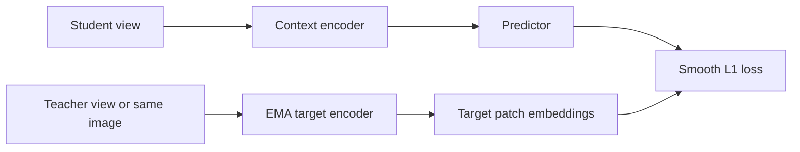

# Technical Report: I-JEPA CIFAR-10 v3 Package

## Abstract

This package ships a ~9.9M-parameter I-JEPA model trained on CIFAR-10 that
achieves **77.2%** top-1 accuracy under a tuned linear probe. The codebase
includes training, evaluation, looped-predictor ablations, visualization tools,
transfer probing, and an interactive Gradio demo.

## Architecture



Components:

1. **Encoder**: ViT over visible context patches (trainable)
2. **Target encoder**: EMA copy encoding full image (frozen, stop-gradient targets)
3. **Predictor**: narrow ViT predicting target patch embeddings from context

## Baseline results (v3)

| Metric | Value |
| --- | --- |
| Tuned linear probe | 77.21–77.23% |
| Best probe LR | 3e-3 |
| feat_std | 0.1607 |
| Epochs | 300 |

Healthy `feat_std` (>0.15) indicates no representation collapse.

## Looped predictor extension

The Ouro-style looped predictor re-applies the predictor block stack for multiple
steps. An optional exit gate encourages diverse exit depths. Ablation results
are produced via `scripts/ablation_loops.py` and saved to `runs/ablation_results.json`.

## Visualizations

```bash
python scripts/visualize.py \
  --config configs/image_jepa_cifar10_v3.yaml \
  --checkpoint checkpoints/baseline_v3/latest.pt
```

Outputs under `runs/visualizations/`:

- Training curves from `metrics.jsonl`
- Context/target mask overlay
- PCA embedding scatter
- Probe LR sweep chart

## Transfer evaluation

CIFAR-100 (downscaled to 32×32) as a lightweight transfer benchmark:

```bash
python scripts/transfer_probe.py \
  --dataset cifar100 \
  --checkpoint checkpoints/baseline_v3/latest.pt
```

**Result (v3 encoder, frozen): 46.32% top-1** on CIFAR-100 (100 classes). See `runs/transfer_cifar100.json`.

Custom folder datasets (Roboflow exports):

```bash
export ROBOFLOW_EXPORT_URL="https://..."
python scripts/download_roboflow.py --out-dir data/transfer
python scripts/transfer_probe.py --dataset folder --data-dir data/transfer --checkpoint ...
```

## Demo

```bash
uv sync --extra demo
python scripts/gradio_demo.py
```

## Reproducibility

See `REPRODUCTION.md` for environment setup, unit tests, full training, and
probe reproduction. Six shape/config tests in `tests/test_shapes.py` guard core
invariants.

## Conclusion

v3 remains the best single-view recipe at this scale. Failed v4/v5 experiments
(two-view, harder masking) are documented in `REPORT.md`. The package is structured
for extension: looped predictor ablations, transfer probes, visual diagnostics, and
a demo suitable for portfolio presentation.
